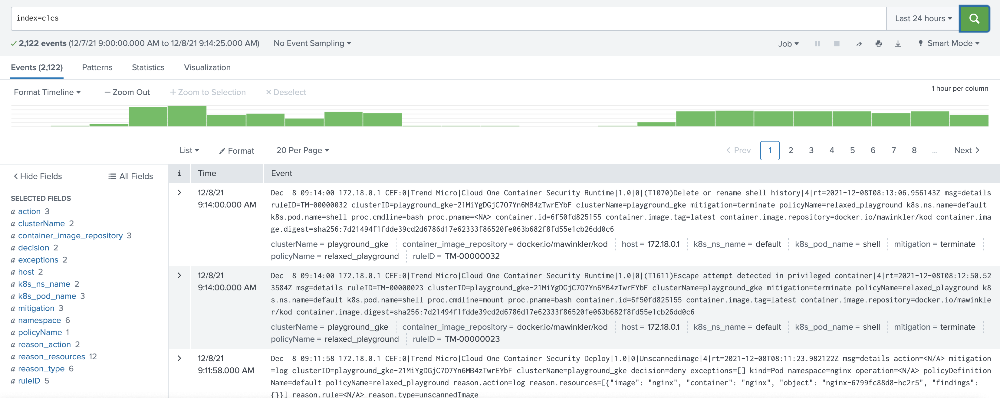

# Cloud One Container Security Runtime Events Forwarder

Queries events interval based from the Runtime Security sensors of Cloud One Container Security and forwards them in CEF format to SIEM / Big Data Engines. Tested with Splunk Enterprise only.



For the CEF event formatting I'm using <https://github.com/kamushadenes/cefevent>

> Currently, only CEF via UDP is supported.

## Usage

Create a config.yml based on the sample file provided and run 

```sh
python3 cs_rslog.py
```

To run in continuously, simply run it as a container:

```sh
docker build -t c1cs-rslog .
docker run -d c1cs-rslog
```

## Support

This is an Open Source community project. Project contributors may be able to help, depending on their time and availability. Please be specific about what you're trying to do, your system, and steps to reproduce the problem.

For bug reports or feature requests, please [open an issue](../../issues). You are welcome to [contribute](#contribute).

Official support from Trend Micro is not available. Individual contributors may be Trend Micro employees, but are not official support.

## Contribute

I do accept contributions from the community. To submit changes:

1. Fork this repository.
1. Create a new feature branch.
1. Make your changes.
1. Submit a pull request with an explanation of your changes or additions.

I will review and work with you to release the code.
